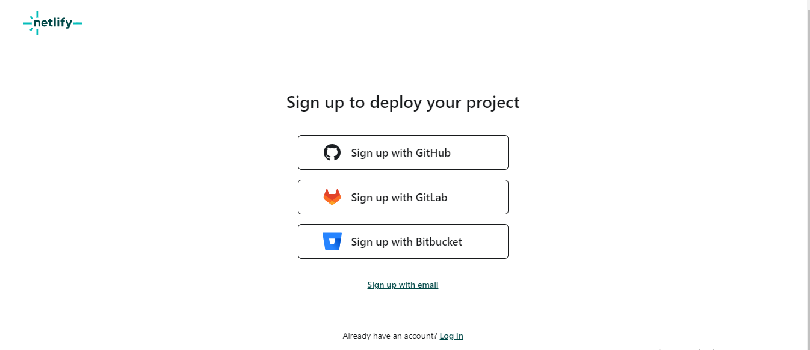
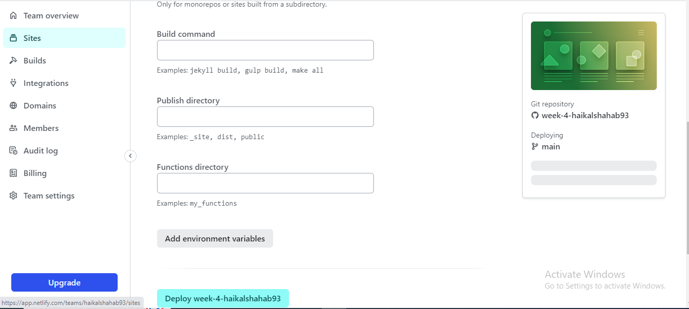
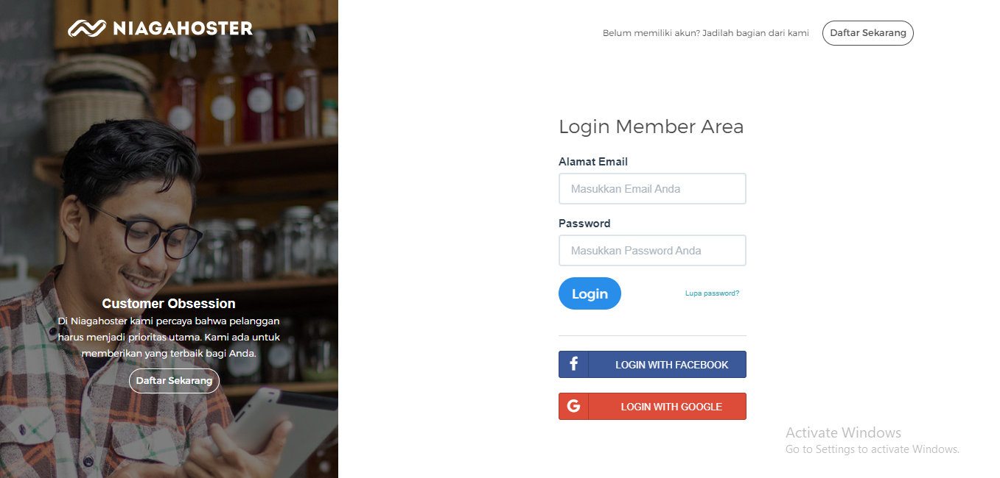
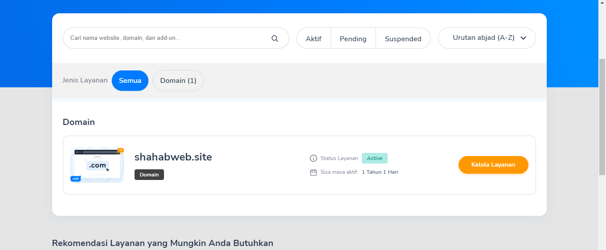
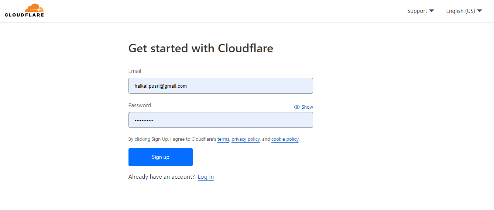
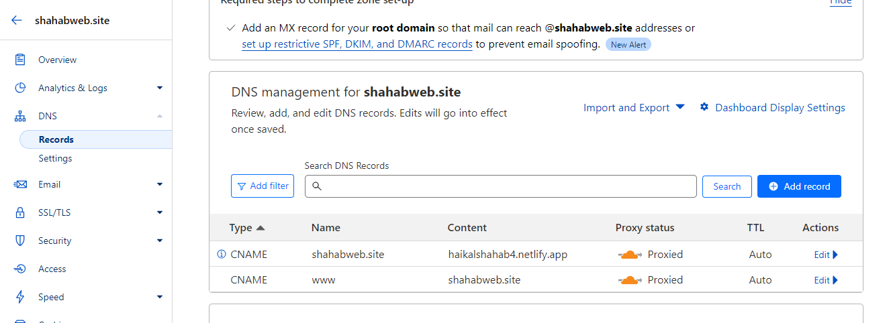
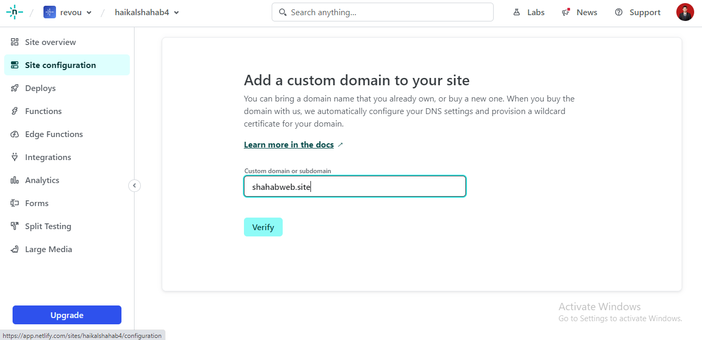
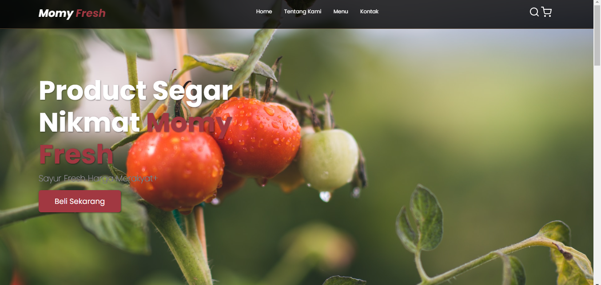

# Muhammad-Haikal-Shahab_Weekly_W5

# Netlify

1. Tahap Pertama Daftarkan Akun Netlfy Dengan Cara menyambungkan Ke Github seperti gambar di bawah ini.

2. Tahap Kedua Setelah Akun Netlify Sudah Terdaftar dan Auto Login , Masuk Ke Menu Team Overview, Dan Klik Add New Site, Import An Existing Project untuk membuat Project Netlify. Seperti gambar di bawah ini.

3. Tahap Ketiga , Setelah itu sambungkan project netlify dengan github repository, kemudian akan terautoriksasi dengan github dan akan muncul repository githubnya, pilih repository yang akan di deploy dan lanjutka proses deploy seperti gambar di bawah ini.

4. Tahap Ke empat ganti nama domain sesuai yang anda inginkan dengan cara memilih site configuration dari site yang kita buat , kemudian pilih site details ubah klik change site name dan ganti nama sesuai yang anda inginkan.

# Niagahoster

1. Tahap Pertama Login Niagahoster dengan menyambungan ke email

2. Tahap Kedua Beli Domain Sesuai Keinginan, selanjutnya setelah itu lakukan pembayaran sesuai dengan metode pembayaran yang di di inginkan.

3. Tahap Ketiga Setelah Domain dibuat maka akan bisa dilakukan pengelolaan layanan dari domain tersebut.

# CloudFlare

1. Tahap Pertama Registrasi dengan memasukan Email dan Password, dan setelah itu akan langsung masuk ke halaman Cloudflare Dashboard

2. Tahap Kedua Setelah Kemenu Dashboard, Pilih Website dan Add Site berdasarkan domain Niagahoster yang sebelumnya kita buat seperti dibawah ini dan klik add site.

3.Tahap Ketiga .
 * pilih Free ( untuk plan for website kita ) dan klik continue
 * selanjutnya untuk review dns di lewatkan terlebih dahulu dan klik continue dan konfirmasi
 * selanjutnya pada menu change your name server, akan muncul 2 nama server cloudflare seperti dibawah ini. 
 
 
 * selanjutnya masukan ke niagahoster domain kita dan ganti nama server dengan klik ubah nama server dan masukan nama server yang kita dapatkan dari cloudflare dan simpan seperti gambar di bawah ini
 
 

 4. Tahap Ke Empat Setting Quick Start Guide Pada  Improve Security,Automatic HTTPS Rewrites,Optimize performance,Summary dengan langsung klik save saja dan klik Finish

  

  5. Tahap Kelima  Klik Check Nameserver dan akan menunggu sampai server kita aktif paling lambat 1x24 jam 
  

  6. Tahap  Ke Enam, setelah site kita yang di cloudflare aktif dan tersambung ke niagahoster. 
  * klik sitenya 
  * setelah pilih DNS -> Record
  * Klik  Add record
    * Cname @ haikalshahab4.netlify.app -> untuk menyambungkan netlify dan cloudflare
    * Cname www shahabweb.site -> untuk menyambungkan niagahoster  dan cloudflare
      

  7. Tahap Ketujuh ,  pada halaman netlify aksesnya , 
  * pilih site configuration, 
  * klik domainn management ,  
  * klik add domain alias. 
  * masukan domain yg anda buat di niagahoster seperti berikut ini
  
  * simpan.
 
 8. Berhasil dan tampilan website dengan domain yang dibuat niagahoster sukses
  
   [websites](https://haikalshahab5.netlify.app)

 

hi, i'm [Muhammad Haikal Shahab](www.linkedin.com/in/mhaikalshahab), a passionate self-taught full stack web developer and a freelance software engineer from indonesia. my passion for software lies with dreaming up ideas and making them come true with elegant interfaces. i take great care in the experience, architecture, and code quality of the things I build.

  
  
- 💼 i'm work in PT PUSRI Palembang, [email](mailto:haikal.pusri@gmail.com) :)
- 💬 ask me about anything, i am happy to help;

**languages and tools:**  

<code></code>
<code></code>
<code></code>
<code></code>

 
 
 